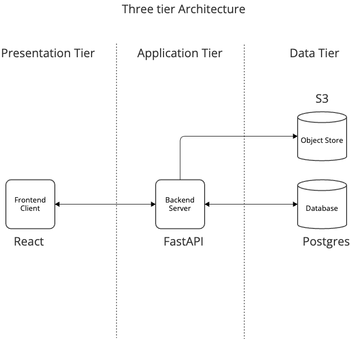

# Business requirements
- two user roles: instructor (teacher) and student
- authentication and authorization JWT
- instructor can create courses, edit, delete and list them on the dashboard, 
- instructor can be paid if someone rolls for the course
- instructor can edit his profile (bank account, about, contact)
- student can roll in the course (can buy it)
- student can search for the course
- student can edit his profile (bank account, about, contact)
- student can have access to courses he joined
- course can track student's progress (in %)
- course have many sections, sections can have many lessons
- other actions are permitted

# System Architecture

